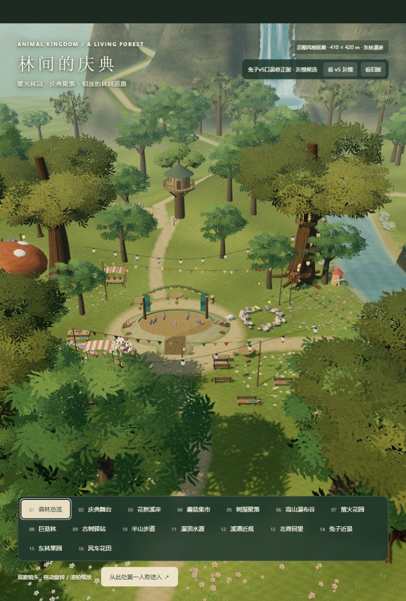

# 送给女儿的礼物

**动物派对 · 森林派对 | Animal Party · Forest Party**

想送给女儿一片可以走进去的森林。

这里会有林间的小路、溪流与瀑布、树屋和花园，也会有一群可爱的动物朋友，在森林里一起准备一场小小的庆典。

这份礼物还没有做好。现在的每一条路、每一片花田、每一盏灯，都是准备过程中的一点点进展。

> **目前还只是一个早期雏形，仍在精心准备中。**
>
> 当前主要在搭建世界，打磨场景、光影和探索体验。正式的动物形象模型还没有构建完成，角色制作仍待开展。画面中已有的动物是临时素材、占位模型或实验候选，不代表最终形象，也不是角色建模已经完成。

## 正在慢慢长大的世界

- 保持第一人称，在森林里自由走动、转头，也可以升高视角看看远处。
- 庆典舞台、蘑菇集市、树屋聚落、花桥溪岸、高山瀑布谷、萤火花园、巨菇林和古树驿站已经有了初步空间。
- 新增东林果园与风车花田，通过林间道路与原有区域相连。
- 可以靠近点亮小灯笼、轻拨风铃，或看看从花丛中飞起的彩蝶。

目前的可探索边界约为 **410 × 420 米**。能运行、能探索，不代表已经达到最终的美术与体验标准；很多地方还需要继续细化。

### 当前开发画面

下面是实际运行截图，不是最终效果承诺。画面里的动物也仍然是临时形象。



## 接下来想认真做好的事

- 让每个区域都更自然、更丰富，有值得停留的小细节。
- 继续打磨光影、植被、岩壁、水流与瀑布的质感。
- 制作符合统一画风的正式动物形象、服装和动作；后续计划借助 Tripo 制作角色资产。
- 增加温柔、简单、有回应的小互动，逐步形成真正的游玩体验。
- 优化资源体积、加载速度与运行性能。

世界以项目的[森林动物庆典总图](docs/images/style-reference.png)为风格基线。《塞尔达传说：旷野之息》仅作为自然环境质感和探索体验的参考，不使用其游戏素材，也不以复刻其地图或角色为目标。

## 在本地看看

技术栈：**Three.js + TypeScript + Vite**。已在 **Node.js 22.20.0 / npm 10.9.3** 下验证。

```bash
git clone https://github.com/wzwailr/openworld-animal-party.git
cd openworld-animal-party
npm ci
npm run dev
```

打开终端显示的本地地址，默认是 <http://127.0.0.1:5173/>。

- 世界观察入口：<http://127.0.0.1:5173/?view=world>
- 选择一个区域，再点击「从此处第一人称进入」。
- 本项目目前仅提供源码与本地预览，没有发布在线正式版。

### 操作方式

| 操作 | 按键 |
| --- | --- |
| 转动视角 | 鼠标移动；兼容模式下移到画面边缘可持续转向 |
| 向视角方向前后左右移动 | W / A / S / D |
| 加速 | Shift |
| 升高、松开后悬停 | 按住空格 |
| 下降 | Ctrl 或 C |
| 与附近景物互动 | 看向目标后按 E 或点击画布 |
| 回到入口 | R |
| 暂停 | Esc |

当前主要面向桌面键鼠操作，尚未提供完整的手机触屏漫游控制。

## 开发检查

```bash
npm test
npm run typecheck
npm run build
```

测试涵盖地形与可见路面的一致性、第一人称移动、区域路线、碰撞、交互和候选资产的技术检查。**测试通过不等于画面或角色已完成视觉验收。**

仓库不包含依赖目录、构建产物、大型 Blender 制作原档、生成过程文件和本机会话资料。两项依赖本地 v4 Blender 归档的历史检查，在没有该归档时会明确显示为跳过；运行时模型与世界相关检查仍正常执行。

### 已知不足

- 场景仍有明显的早期、程序化搭建痕迹，不能视为最终美术效果。
- 正式角色资产和角色动画尚未完成；不要把实验兔子候选当作成品。
- 部分临时动物素材存在贴图加载问题。
- 构建仍有主 JavaScript 包体偏大的警告，加载与性能优化尚待继续。
- 尚未形成完整剧情、任务或长期游玩循环。

## 素材与署名

第三方临时动物素材的来源与原有授权说明见 [CREDITS](docs/CREDITS.md)。第三方素材与项目原创内容的授权范围不同，请勿将仓库公开理解为所有素材均可任意使用。项目原创代码和美术内容暂未另行授予开源许可证。

---

不急着把它称为一款完成的游戏。

先认真准备，希望有一天，她走进这片森林时，会觉得这是一份属于她的礼物。
